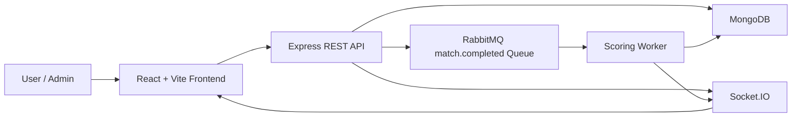
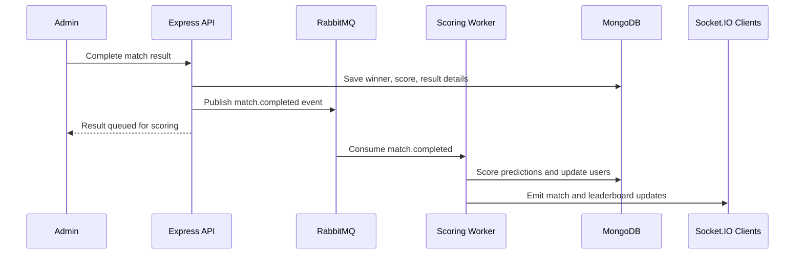

# EsportsEdge

Valorant-first esports prediction and analytics platform built with the MERN stack, RabbitMQ background processing, and real-time leaderboard updates.

EsportsEdge lets users browse upcoming Valorant matches, lock predictions, view rule-based match insights, and compete on a leaderboard. Admins can manage esports data, complete match results, and trigger background scoring through RabbitMQ.

## Project Highlights

- Built a full-stack prediction platform with React, Express, MongoDB, RabbitMQ, and Socket.IO.
- Exposes 24 REST API endpoints across auth, admin data, matches, predictions, analytics, and leaderboard flows.
- Supports 6 admin-managed esports entities: teams, players, tournaments, matches, maps, and agents.
- Enforces 1 prediction per user per match and locks predictions after match start.
- Scores predictions across 4 categories: winner, scoreline, first map winner, and top fragger.
- Uses a durable RabbitMQ `match.completed` queue for background scoring.
- Ships with 50+ realistic Valorant seed records, including 8 teams, 12 players, 6 matches, 12 agents, and 9 maps.
- Includes 12 backend tests covering health, auth, admin protection, predictions, scoring, and analytics.

## Tech Stack

| Layer | Tools |
| --- | --- |
| Frontend | React, Vite, Tailwind CSS, TanStack Query, Socket.IO Client |
| Backend | Node.js, Express.js, MongoDB, Mongoose |
| Auth and Validation | JWT, bcrypt, Zod |
| Background Jobs | RabbitMQ, amqplib |
| Real Time | Socket.IO |
| Testing | Jest, Supertest |
| Tooling | Docker, Docker Compose, Postman, npm |

## Core Features

### User Features

- Register and login with JWT authentication.
- Stay logged in using local token storage.
- View profile stats: points, accuracy, and streak.
- Browse database-backed Valorant matches.
- Search and filter matches by team, tournament, and status.
- Submit predictions for winner, scoreline, first map winner, and top fragger.
- View leaderboard rankings and rule-based match insights.

### Admin Features

- Role-based admin access using an invite code.
- Create and list teams, players, tournaments, matches, maps, and agents.
- Complete match results from the admin panel.
- Trigger prediction scoring through RabbitMQ.
- Broadcast match and leaderboard updates through Socket.IO.

### Analytics Features

EsportsEdge uses rule-based analytics instead of machine learning. The current analytics engine calculates:

- Momentum score from recent team form.
- Map advantage signal from matchup context.
- Upset alert based on form gaps.
- Human-readable insight text for each match.

## Architecture



## Match Completion Flow



If RabbitMQ is unavailable during local development, the backend falls back to inline scoring so the app remains usable.

## Local Setup

### 1. Clone and Install

```bash
git clone https://github.com/SourabhNaidu/EsportsEdge.git
cd EsportsEdge
npm install
npm --prefix client install
```

### 2. Create Environment File

Create `.env` from `.env.example`:

```bash
cp .env.example .env
```

On Windows PowerShell:

```powershell
Copy-Item .env.example .env
```

Example local values:

```env
PORT=5000
NODE_ENV=development
CLIENT_URL=http://localhost:5173
MONGODB_URI=mongodb://127.0.0.1:27017/esportsedge
RABBITMQ_URL=amqp://127.0.0.1:5672
JWT_SECRET=replace-with-a-long-random-secret
JWT_EXPIRES_IN=7d
ADMIN_INVITE_CODE=admin123
```

### 3. Start MongoDB and RabbitMQ

```bash
docker compose up -d mongo rabbitmq
```

Services:

- Frontend: `http://localhost:5173`
- Backend: `http://localhost:5000`
- Health check: `http://localhost:5000/api/health`
- RabbitMQ dashboard: `http://localhost:15672`

RabbitMQ local dashboard login is usually:

```text
guest / guest
```

### 4. Seed Realistic Demo Data

```bash
npm run seed
```

The seed command adds:

- 8 Valorant teams
- 12 player handles
- 3 tournaments
- 6 upcoming matches
- 12 agents
- 9 maps
- Demo leaderboard users

Demo user password:

```text
Valorant123!
```

### 5. Run the App

```bash
npm run dev
```

This starts the backend and frontend together. The backend also starts the RabbitMQ match-completed worker by default.

## Useful Scripts

| Command | Description |
| --- | --- |
| `npm run dev` | Run frontend and backend together |
| `npm run server:dev` | Run backend only with nodemon |
| `npm run server:start` | Run backend with Node |
| `npm run worker:start` | Run the RabbitMQ scoring worker separately |
| `npm run client:dev` | Run frontend only |
| `npm run client:build` | Build frontend for production |
| `npm run seed` | Seed MongoDB with realistic Valorant data |
| `npm test` | Run backend tests |

## API Overview

### Auth

| Method | Endpoint | Description |
| --- | --- | --- |
| POST | `/api/auth/register` | Create user or admin account |
| POST | `/api/auth/login` | Login and receive JWT |
| GET | `/api/auth/profile` | Get authenticated user profile |

### Matches

| Method | Endpoint | Description |
| --- | --- | --- |
| GET | `/api/matches` | List matches with `status` and `q` filters |
| GET | `/api/matches/:id` | Get match details |

### Predictions

| Method | Endpoint | Description |
| --- | --- | --- |
| POST | `/api/predictions` | Create prediction for a match |
| GET | `/api/predictions/matches/:matchId/me` | Get current user's prediction |
| GET | `/api/predictions/matches/:matchId/percentages` | Get crowd prediction percentages |

### Analytics and Leaderboard

| Method | Endpoint | Description |
| --- | --- | --- |
| GET | `/api/analytics/matches/:matchId` | Get momentum, map advantage, and upset alert |
| GET | `/api/leaderboard` | Get ranked prediction leaderboard |

### Admin

All admin endpoints require an admin JWT.

| Method | Endpoint | Description |
| --- | --- | --- |
| GET / POST | `/api/admin/teams` | List or create teams |
| GET / POST | `/api/admin/players` | List or create players |
| GET / POST | `/api/admin/tournaments` | List or create tournaments |
| GET / POST | `/api/admin/matches` | List or create matches |
| POST | `/api/admin/matches/:id/result` | Complete match and publish scoring job |
| GET / POST | `/api/admin/maps` | List or create maps |
| GET / POST | `/api/admin/agents` | List or create agents |

## Testing and Verification

Run backend tests:

```bash
npm test
```

Run frontend lint:

```bash
npm --prefix client run lint
```

Build frontend:

```bash
npm run client:build
```

Audit dependencies:

```bash
npm audit --omit=dev
npm --prefix client audit --omit=dev
```

Check RabbitMQ queue:

```bash
docker exec esportsedge-rabbitmq rabbitmqctl list_queues name messages consumers
```

Expected local queue state after startup:

```text
name             messages   consumers
match.completed 0          1
```

## Resume-Safe Summary

Built EsportsEdge, a Valorant-first MERN esports prediction platform with 24 REST API endpoints, JWT role-based admin workflows, RabbitMQ background scoring, Socket.IO real-time leaderboard updates, Dockerized MongoDB/RabbitMQ infrastructure, and rule-based momentum analytics.

## Notes

- Seeded match schedules are realistic demo data for portfolio use, not official VCT schedule data.
- Public match browsing still has a demo fallback if MongoDB is offline.
- RabbitMQ is used for completed-match scoring, with inline scoring fallback for local resilience.
